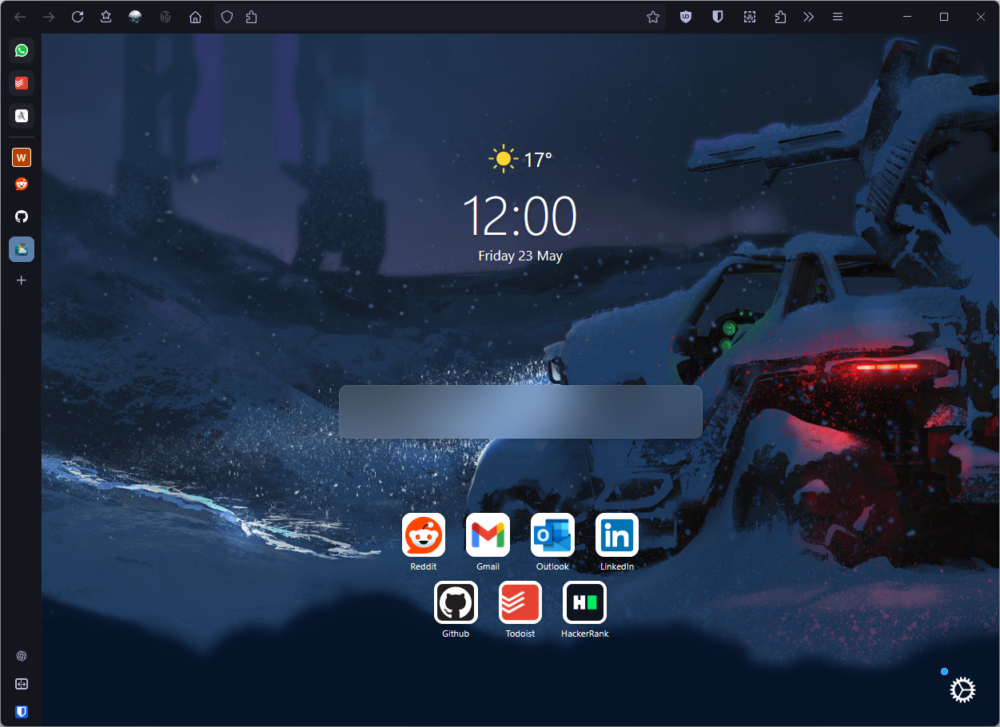

# Firefox Style

My configuration for Firefox using custom CSS and Firefox UI Fix.

## Themes
* [Nordic Night Frost](https://addons.mozilla.org/en-US/firefox/addon/nordic-night-frost/)
([Firefox Color](https://color.firefox.com/?theme=XQAAAAKLBAAAAAAAAABBqYhm849SCicxcUfbB38oKRicm6da8pFTtcQNgw19Pc1aZ4ZDQ499FUcuYB-_purP28XDcZ8buogJXEnT18uY8wbMPln-RxssnsSu-E9LxF_sImdrTlELKFc63auxAoTUEgzyuZU3uZ0cfd6mDmmDNt0TKH6Ed2fhpOZbOTPoKh7GrWDtuqpL29v-PEtg0QMEuKpcPnxkFEeSLyWJtfJtxo99fgEHdCp5Tdl0vgKZOgNUaC6MkUm0a79Ymbe3VXkg2gP_OaLTfAoDbo6jZPvA_6REyYgECZ1FaYg01Nwg2qwGmtvSTeP3vcPJw1M9d3afA5Qj7yAE4uTdVSGQxa1S1c1FZktd9zFDE37tKtfFnE_F6ZRvp1IdN-Tcw9uDfM5ryYb3eZRugMrMhGiL69q8AcogrS0Zc_cH4XaaFNz80JJSalwoFd6u5sNwYzIBdtMy6Plf_I26QPFlKDuiGQ8QuRlSg77eW6HY2K2VhVkeGUdihvq5bRrZoMBo4PYtfVZ0TjC5npoKiyI4FduIsJTp99FdlpYVI6yFl0mcwIT9obVzz78tlfiARz9bFNqFLbt7Sdzw-h3_yZUdjg))

* [Dark Night Frost](https://addons.mozilla.org/en-US/firefox/addon/dark-night-frost/)

## Acknowledgments
* [Firefox UI Fix](https://github.com/black7375/Firefox-UI-Fix)
* [Firefox CSS Hacks](https://github.com/MrOtherGuy/firefox-csshacks)
* [Icons](https://www.iconfinder.com/remix-icon)